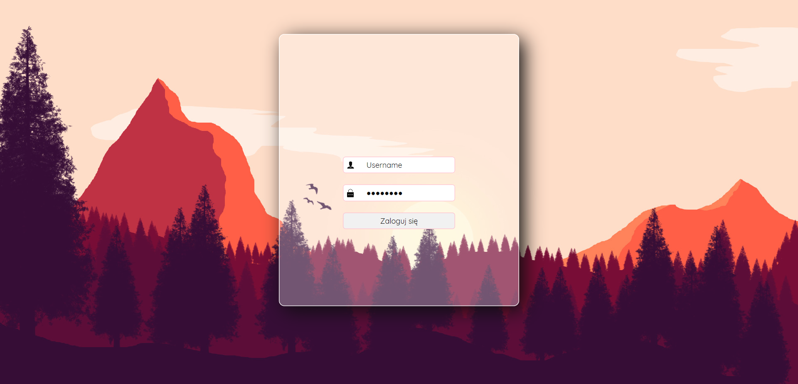
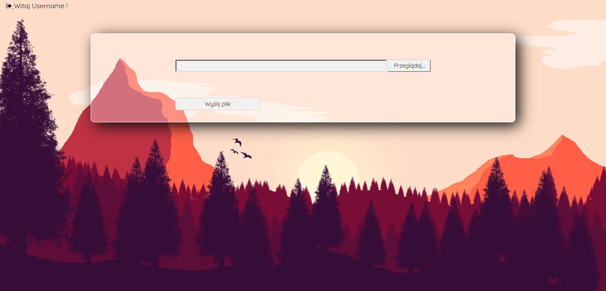

# Login/logout system
> This repository contains code of website with users login/logout and upload files system.

## Table of contents
* [General info](#general-info)
* [Screenshots](#screenshots)
* [Technologies](#technologies)
* [Features](#features)
* [Status](#status)
* [Contact](#contact)

## General info
This page was created as a exercise with PHP script language and there predefined values like _$_GET_, _$_POST_, _$_FILES, _$_SESSION_, _$_COOKIE_.

## Screenshots

## Technologies
* PHP
* CSS 3

## Features
To-do list:
* Better customization of the site for mobile devices
* Add users register to system
* Add connection with database

## Status
Project is: _in progress_

## Contact
Created by [@PJasiczek](http://www.piotrjasiczek.pl/) - feel free to contact me!

